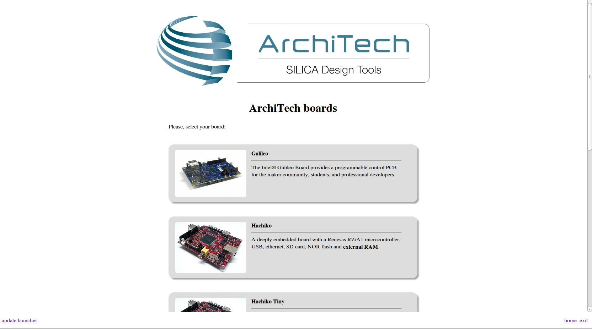

.. important::

 A working internet connection, several GB of free disk space and several hours are required by the build process

1. Select Architech's virtual machine from the list of virtual machines inside Virtual Box application

.. image:: _static/vdi_machine_listed.png
    :align: center

2. Click on the icon *Start* button in the toolbar and wait until the virtual machine is ready

.. image:: _static/vbStart.png
    :align: center

3. Double click on *Architech SDK* icon you have on the virtual machine desktop.
	
.. image:: _static/splash0.jpg
    :align: center

4. The first screen gives you two choices: *ArchiTech* and *3rd Party*. Choose *ArchiTech*.

.. image:: _static/splash1.jpg
    :align: center

5. Select @board@ as board you want develop on. 

6. A new screen opens up from where you can perform a set of actions. Click on *Run bitbake* to obtain a terminal ready to start to build an image.

.. image:: _static/splash3.jpg
    :align: center

7. Open *local.conf* file:

.. host::

 | gedit conf/local.conf

8. Go to the end of the file and add the following lines:

.. host::

 | IMAGE_INSTALL_append = " tcf-agent gdbserver"

This will trigger the installation of a features set onto the final root file system, like *tcf-agent* and *gdbserver*.

Now set BB_NUMBER_THREADS and PARALLEL_MAKE values:  

.. host::

 | BB_NUMBER_THREADS = X
 | PARALLEL_MAKE = X

.. warning::

 | where X is the number of cores You assigned to the virtual machine multiplied for 2

9. Save the file and close gedit.

10. Build *@quickstart-image@* image by means of the following command:

.. host::

 | bitbake @quickstart-image@

At the end of the build process, the image will be saved inside directory:

.. host::

 | /home/@user@/architech_sdk/architech/@board-alias@/yocto/meta-clanton_v1.0.1/yocto_build/tmp/deploy/images/

11. Setup *sysroot* directory on your host machine. 

.. host::

 | cd /home/@user@/architech_sdk/architech/@board-alias@/yocto/meta-clanton_v1.0.1/yocto_build/tmp/deploy/images/
 | mkdir rootfs
 | sudo mount -o loop image-full-galileo-clanton.ext3 rootfs/
 | cd rootfs
 | sudo cp -r * ~/architech_sdk/architech/galileo/sysroot
 | cd ..
 | sudo umount rootfs
 | cd /home/@user@/architech_sdk/architech/@board-alias@/toolchain/sysroots/i586-poky-linux-uclibc
 | sudo cp -r * /home/@user@/architech_sdk/architech/@board-alias@/sysroot/
 | sudo chown -R @user@:@user@ ~/architech_sdk/architech/galileo/sysroot

.. note::

 **sudo** password is: "**@user-password@**"

.. important::

 | Eclipse needs the *sysroot* directory to compile. 
 | The cross-toolchain looks for the required libreries in *sysroot*.
 | All the files in *sysroot* needs to be also in the sdcard.

